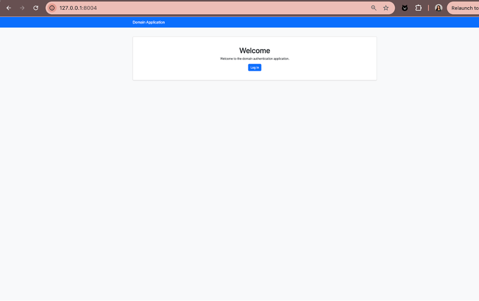
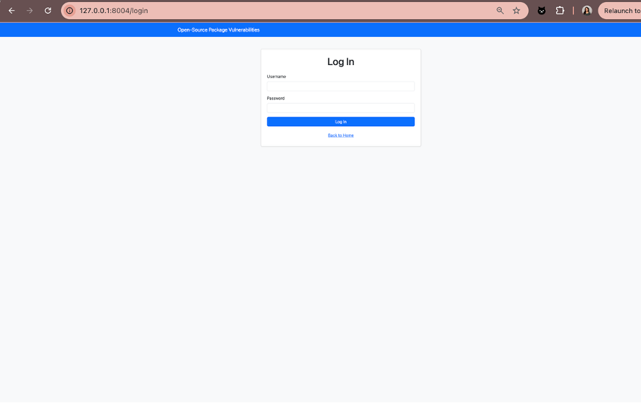
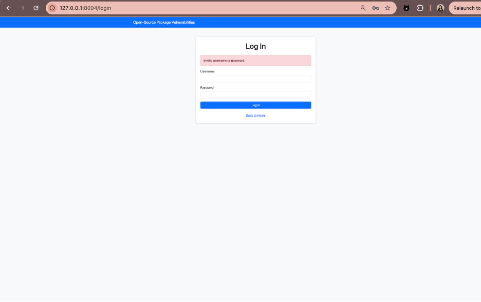
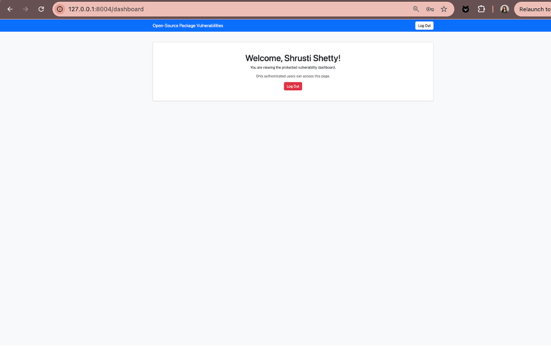
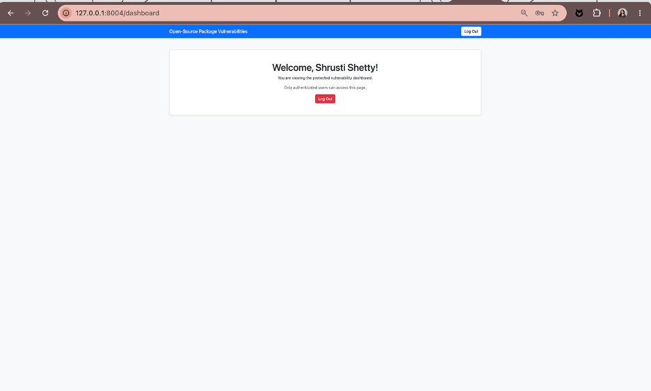
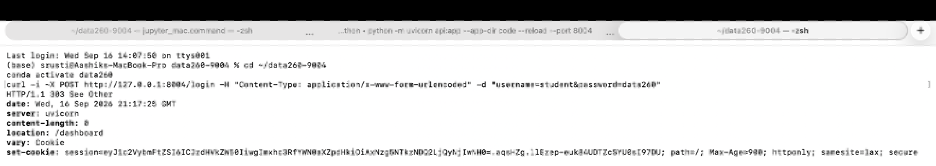
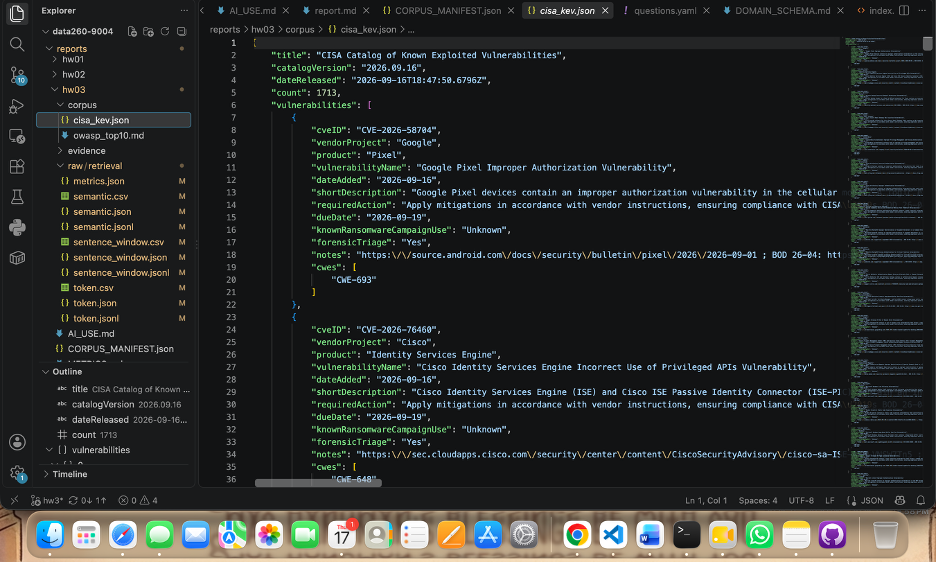
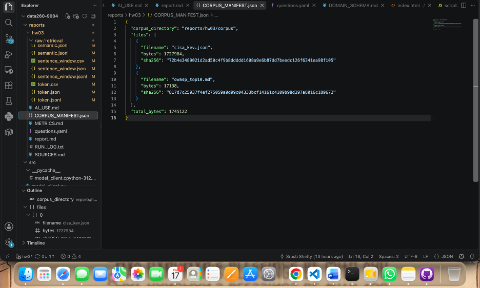
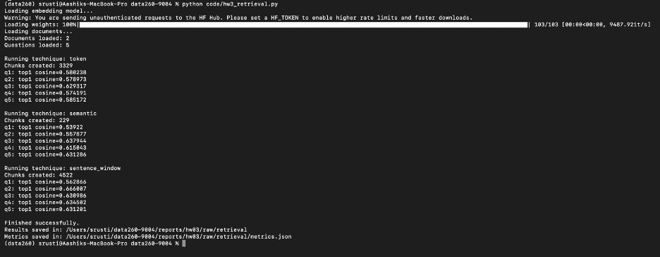
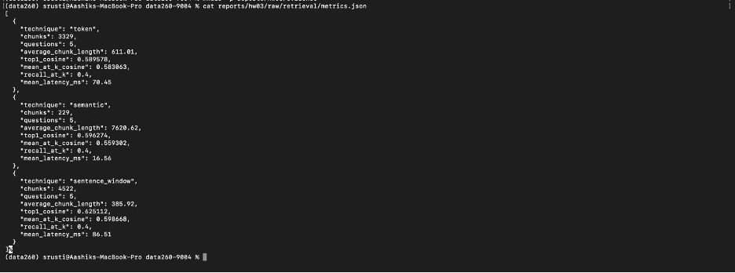

# DATA-260 Homework 3 Report

## Student Information

- Student: Shrusti Shetty
- SID4: 9004
- Domain: Open-Source Package Vulnerabilities
- Branch: `hw3`
- Final tag: `hw3`

## 1. Project Overview

This project implements a secure FastAPI vulnerability-report application and a local retrieval system.

The application includes:

- Login and logout
- Protected dashboard access
- Session timeout
- Secure session cookies
- Public vulnerability-report corpus files
- Retrieval using token, semantic, and sentence-window chunking
- Cosine-similarity evaluation and metrics

## 2. Authentication

The authentication system is implemented in `code/auth.py`.

The application provides these routes:

- `/` — public home page
- `/login` — login page and login submission
- `/dashboard` — protected dashboard
- `/logout` — clears the user session

The test account is:

- Username: `student`
- Password: `data260`

The dashboard is protected by checking the session username. If a user is not logged in, the application redirects the user to `/login`.

The session stores:

- Username
- Last activity timestamp

The session timeout is 900 seconds. When the timeout is exceeded, the session is cleared and the user must log in again.

`SessionMiddleware` provides:

- Signed session cookies
- HTTP-only cookies
- SameSite protection
- Session expiration

## 3. Corpus Sources

The retrieval corpus contains two public sources:

1. CISA Known Exploited Vulnerabilities Catalog
2. OWASP Top 10: 2021

The local corpus files are:

- `reports/hw03/corpus/cisa_kev.json`
- `reports/hw03/corpus/owasp_top10.md`

The source URLs, file sizes, and SHA-256 hashes are documented in:

- `reports/hw03/SOURCES.md`
- `reports/hw03/CORPUS_MANIFEST.json`

The total corpus size is 1,745,122 bytes, which is larger than the required minimum corpus size.

## 4. Questions

Five questions were evaluated.

The CISA questions ask about:

- The purpose of the Known Exploited Vulnerabilities Catalog
- The `requiredAction` and `dueDate` fields

The OWASP questions ask about:

- A03:2021 Injection
- A05:2021 Security Misconfiguration
- A07:2021 Identification and Authentication Failures

The questions and expected answers are stored in:

`reports/hw03/questions.yaml`

## 5. Retrieval Methods

Three chunking techniques were evaluated.

### Token Chunking

Token chunking divides the documents into fixed-size overlapping pieces.

Configuration:

- Chunk size: 256
- Chunk overlap: 40

### Semantic Chunking

Semantic chunking groups text based on semantic similarity and detects possible topic boundaries.

### Sentence-Window Chunking

Sentence-window chunking creates nodes around sentences while preserving nearby sentence context.

Configuration:

- Window size: 3 sentences

Each chunk was converted into an embedding using:

`sentence-transformers/all-MiniLM-L6-v2`

The system calculated explicit cosine similarity between the query embedding and each retrieved chunk embedding.

## 6. Retrieval Metrics

| Technique | Chunks | Average chunk length | Top-1 cosine | Mean@k cosine | Recall@k | Mean latency |
|---|---:|---:|---:|---:|---:|---:|
| Token | 3329 | 611.01 | 0.589578 | 0.583063 | 0.40 | 70.45 ms |
| Semantic | 229 | 7620.62 | 0.596274 | 0.559302 | 0.40 | 16.56 ms |
| Sentence window | 4522 | 385.92 | 0.625112 | 0.598668 | 0.40 | 86.51 ms |

## 7. Results

Sentence-window retrieval produced the highest top-1 cosine similarity and the highest mean cosine similarity across the top three results.

Semantic retrieval was the fastest technique because it created only 229 chunks. However, the semantic chunks were very large, with an average length of 7,620.62 characters.

Token chunking produced a balanced result between chunk size, similarity, and latency.

Recall@k was 0.40 for all techniques. This means the expected source file was retrieved for two out of the five questions.

## 8. Incorrect Retrieval Example

One retrieval result returned a CISA chunk for a question whose expected source was the OWASP document.

This is a confident-but-incorrect retrieval because the CISA chunk contained security-related vocabulary that was similar to the question, even though it did not contain the expected OWASP category.

This demonstrates why cosine similarity alone is not enough. The retrieved source and answer must also be checked against the expected source and question.

## 9. Generated Output Files

The retrieval program created these files:

- `token.json`
- `token.csv`
- `token.jsonl`
- `semantic.json`
- `semantic.csv`
- `semantic.jsonl`
- `sentence_window.json`
- `sentence_window.csv`
- `sentence_window.jsonl`
- `metrics.json`

They are stored in:

`reports/hw03/raw/retrieval/`

Each result records:

- Question ID
- Query text
- Query embedding dimension
- First eight query embedding values
- Retrieved chunks
- Stored retrieval score
- Explicit cosine similarity
- Source file
- Chunk length
- Chunk preview
- Vector dimension and shape
- Latency

## 10. Reproducibility

Activate the project environment:

`conda activate data260`

Run the syntax check:

`python -m py_compile code/hw3_retrieval.py`

Run the retrieval experiment:

`python code/hw3_retrieval.py`

The metrics are saved to:

`reports/hw03/raw/retrieval/metrics.json`

## 11. Conclusion

The project successfully combines FastAPI authentication with local document retrieval.

The authentication system protects the dashboard using sessions and timeout checks.

The retrieval experiment shows that sentence-window chunking produced the strongest cosine-similarity results for this corpus. Semantic chunking was fastest, while token chunking provided a balanced alternative.

The experiment also shows that retrieval scores must be interpreted together with source validation because a high similarity score can still return an incorrect source.

## 12. Evidence Screenshots

### Home Page

### Login Page

### Invalid Login

### Protected Dashboard

### Session Timeout

### Session Cookie

### Corpus Files

### Corpus Manifest

### Retrieval Run

### Retrieval Metrics

