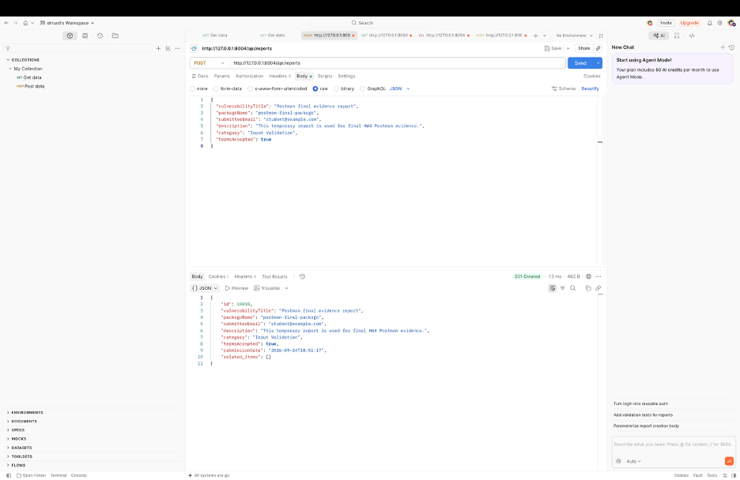
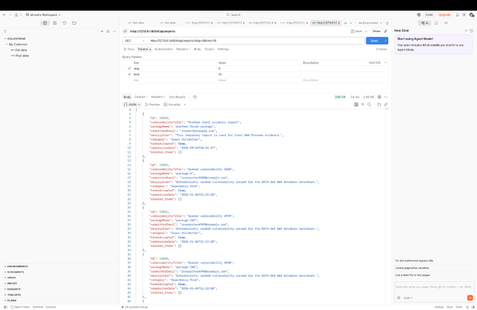
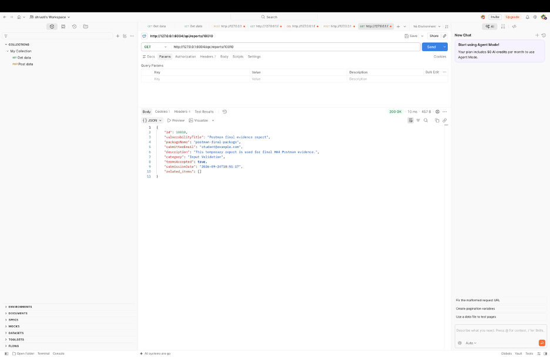
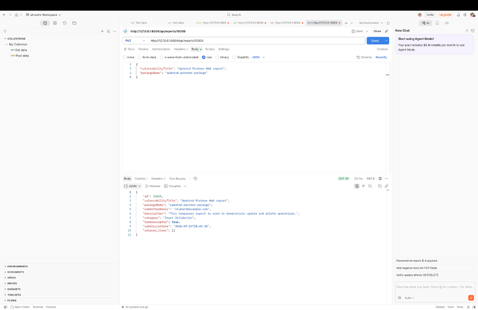
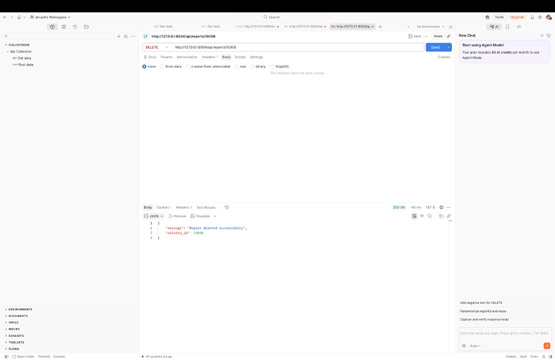
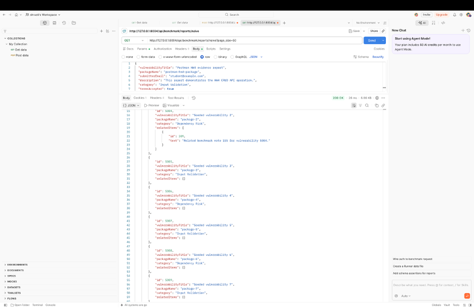
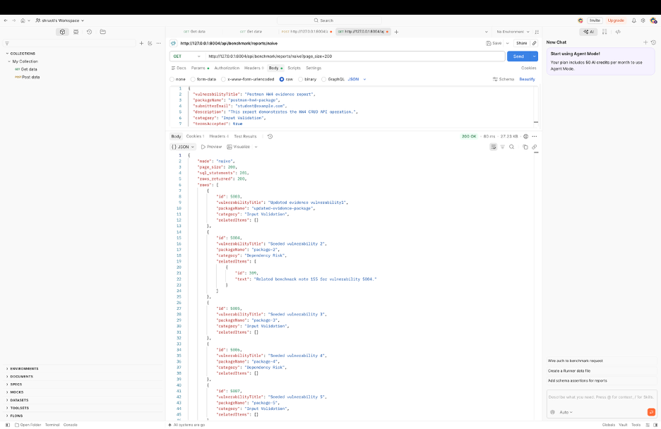
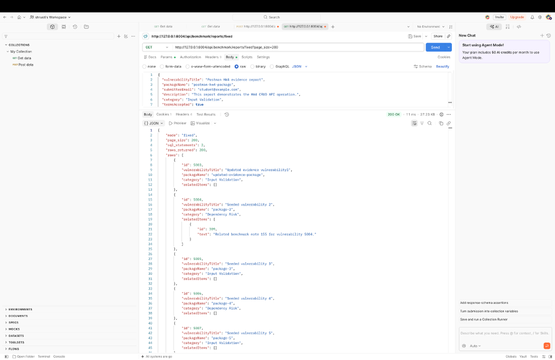

# DATA 260 Homework 4 Report

## Student Information

- Student: Shrusti Shetty
- SID4: 9004
- Domain: Open-Source Package Vulnerabilities
- Branch: `hw4`
- Database: `s9004_rel`
- `PORT_BASE`: `8004`
- `PREFIX`: `s9004`
- `SEED`: `9004`
- `VERIFY_SEED`: `269004`
- `DOMAIN_ID`: `4` (`9004 mod 8`)
- Hardware: MacBook Pro running the local `data260` conda environment
- Local model: `sentence-transformers/all-MiniLM-L6-v2`
- Tagged commit: `1db9122`
- GitHub: [data260-9004](https://github.com/shrustishetty-2401/data260-9004)
- Collaborator access: Sbnikitha and supriyaselvanganesan were given repository access.

## Project Overview

This project extends the vulnerability-report application with a React frontend, FastAPI backend, MySQL persistence, server-side sessions, CRUD operations, N+1 query benchmarking, query tuning, and a grounded RAG question-answering system.

The final implementation includes:

- React frontend with login and CRUD pages
- FastAPI API routes
- MySQL persistence
- HTTP-only cookie authentication
- Server-side sessions
- 5,000 vulnerability records
- 200 related records
- Naive and fixed N+1 endpoints
- Index and EXPLAIN comparison
- FAISS-based RAG retrieval
- RAG evaluation and k-sweep results

## Part 1 React Client

The React client uses React Router to provide separate pages for login, dashboard, creation, updating, and deletion.

Main routes:

- `/login`
- `/`
- `/create`
- `/update/:id`
- `/delete/:id`

The application uses `useState` for form and loading state, `useEffect` for session and report loading, and props to pass callbacks into the Create, Update, and Delete components.

### React routing and protected pages

```jsx
<Route path="/" element={
  <ProtectedRoute user={user}>
    <Home user={user}
      onCreate={() => navigate("/create")}
      onEdit={(id) => navigate(`/update/${id}`)} />
  </ProtectedRoute>
} />
<Route path="/create" element={<CreateRecord onSaved={() => navigate("/")} />} />
<Route path="/update/:id" element={<UpdatePage onSaved={() => navigate("/")} />} />
<Route path="/delete/:id" element={<DeletePage onDeleted={() => navigate("/")} />} />
```

### Login and Dashboard


### Create Record

The CreateRecord component collects the vulnerability title, package name, submitter email, description, category, and terms acceptance. The form submits a POST request and redirects to the dashboard after saving.


### Update Record

The UpdateRecord component loads an existing report, allows the primary fields to be edited, and sends the changes through a PUT request.

```jsx
async function handleSubmit(event) {
  event.preventDefault();
  await updateReport(reportId, form);
  onSaved();
}
```


### Delete Record

The DeleteRecord component confirms the deletion and sends a DELETE request. After deletion, the dashboard reloads without the deleted record.


## Part 2 MySQL Persistence and Sessions

The application uses the MySQL database `s9004_rel` with SQLAlchemy. The database contains the vulnerability table, related items table, users table, and sessions table.

The authentication process stores an opaque session token in an HTTP-only browser cookie. The session itself is stored server-side in the sessions table.

### Database and session implementation

```python
@router.post("/api/auth/login")
def login(payload: LoginPayload, response: Response, db: Session = Depends(get_db)):
    user = authenticate_user(db, payload.email, payload.password)
    token = create_server_session(db, user.id)
    response.set_cookie("session_token", token, httponly=True, samesite="lax")
    return user
```

```python
@router.post("", response_model=ReportOut, status_code=201)
def create_report(payload: ReportCreate, db: Session = Depends(get_db),
                  _user=Depends(current_user)):
    ...

@router.get("", response_model=list[ReportOut])
def list_reports(..., _user=Depends(current_user)):
    ...

@router.put("/{report_id}", response_model=ReportOut)
def update_report(report_id: int, payload: ReportUpdate, ...):
    ...

@router.delete("/{report_id}")
def delete_report(report_id: int, ...):
    ...
```

### Database Tables and Counts


The final database contains:

- 5,000 vulnerability records
- 200 related item records
- users table with unique email values and password hashes
- sessions table with token, user, creation, and expiration fields

### HTTP-Only Session Cookie


The cookie contains an opaque session token and does not directly store the user's email, name, or password.

### API CRUD Operations

The API supports the following operations:

- POST `/api/reports`
- GET `/api/reports`
- GET `/api/reports/{id}`
- PUT `/api/reports/{id}`
- DELETE `/api/reports/{id}`


### Postman CRUD Evidence











### Project Structure


## Part 3 N Plus One Measurement and Query Tuning

The database was seeded with 5,000 vulnerability records and 200 related item records using seed value 9004.

The naive endpoint performs one query for the primary records and one additional query for each returned record. The fixed endpoint uses eager loading with `selectinload`, reducing each request to two SQL statements.

### Seed and query implementation

```python
for index in range(5000):
    db.add(make_seeded_vulnerability(index, seed=9004))

for index in range(200):
    db.add(make_related_item(index, seed=9004))
```

```python
statement = (select(Vulnerability)
             .options(selectinload(Vulnerability.related_items))
             .order_by(Vulnerability.id)
             .offset(skip).limit(page_size))
reports = db.scalars(statement).all()
```

### Naive and Fixed Endpoint Evidence


### Postman N+1 Endpoint Evidence









### Benchmark Metrics

| Page size | Mode | SQL statements/request | p50 ms | p95 ms | p99 ms |
|---:|---|---:|---:|---:|---:|
| 10 | Naive | 11 | 9.721 | 85.905 | 146.621 |
| 10 | Fixed | 2 | 6.858 | 59.823 | 102.780 |
| 50 | Naive | 51 | 23.321 | 172.330 | 186.384 |
| 50 | Fixed | 2 | 7.106 | 40.666 | 105.170 |
| 200 | Naive | 201 | 61.721 | 205.475 | 241.548 |
| 200 | Fixed | 2 | 11.586 | 101.521 | 132.936 |


### Fixed-version improvement

| Page size | Naive SQL | Fixed SQL | SQL reduction | Naive p50 | Fixed p50 | p50 improvement |
|---:|---:|---:|---:|---:|---:|---:|
| 10 | 11 | 2 | 81.82% | 9.721 ms | 6.858 ms | 29.45% |
| 50 | 51 | 2 | 96.08% | 23.321 ms | 7.106 ms | 69.52% |
| 200 | 201 | 2 | 99.00% | 61.721 ms | 11.586 ms | 81.23% |

As the page grows, the naive implementation issues one additional related-item query per record. The fixed implementation batches related rows, so the SQL count stays at two and the performance advantage increases with page size.

### EXPLAIN Before and After the Index


Before the index, MySQL performed a table scan. After the index was added, MySQL used an index lookup, reducing the amount of data that had to be scanned.

## Part 4 Grounded RAG System

The corpus contains seven documents:

- `agent_context.md`
- `cisa_kev.json`
- `corpus_manifest.json`
- `domain_schema.md`
- `hw3_sources.md`
- `owasp_top10.md`
- `project_readme.md`

Documents are chunked with size 500 and overlap 50. Each chunk retains its source and chunk ID. Sentence Transformer embeddings use `sentence-transformers/all-MiniLM-L6-v2`, and vectors are stored in a FAISS index.

### Retrieval implementation

```python
CHUNK_SIZE = 500
CHUNK_OVERLAP = 50
TOP_K = 3
MODEL_NAME = "sentence-transformers/all-MiniLM-L6-v2"

results = vector_store.similarity_search_with_score(question, k=TOP_K)
for rank, (chunk, score) in enumerate(results, start=1):
    print(f"[Source {rank}: {chunk.metadata['source']}] score={score}")
```

### Retrieval Output

The system prints retrieved chunks, source names, chunk IDs, ranks, and similarity scores before generating an answer.


### RAG Configurations

The same six questions were tested with No-RAG, Basic RAG using the top three chunks, and Context-engineered RAG with source labels, ordering, de-duplication, and grounding instructions.


| Configuration | Retrieval/context behavior | Grounding behavior |
|---|---|---|
| No-RAG | No retrieved corpus context | Baseline only |
| Basic RAG | Top-three retrieved chunks | Answers using retrieved text and source labels |
| Context-engineered RAG | Relevant, ordered, labeled, deduplicated chunks | Answers only from evidence and refuses unsupported questions |

### Six-question evaluation summary

| Questions | Correct retrieval | Correct answer | Grounded | Refused when needed |
|---|---|---|---|---|
| Q1–Q4 | Yes | Yes | Yes | Not applicable |
| Q5 | Insufficient evidence detected | Yes | Yes | Yes |
| Q6 | Insufficient evidence detected | Yes | Yes | Yes |

### Required Refusals

Questions Q5 and Q6 cannot be answered from the supplied documents. The exact required refusal is:

> I cannot answer this question from the provided documents


### Context Size Sweep

The system was tested with k values of 1, 3, and 5. Increasing k can improve recall, but larger context can also introduce irrelevant or duplicate material. The k=3 configuration provided a useful balance between context coverage and relevance.


### RAG Analysis

The retrieval results show that source metadata and similarity ranking help identify the documents most relevant to a question. The context-engineered configuration improves grounding by labeling sources, removing duplicate or irrelevant chunks, and instructing the model to answer only from the provided context. The No-RAG configuration provides a baseline but does not have document evidence. Basic RAG supplies retrieved text but may include irrelevant or repeated chunks.

Questions that can be answered directly from one document generally perform well with a small context size. Questions requiring information from multiple documents benefit from retrieving more than one chunk. However, increasing the context size is not always better because unrelated material can distract the model and reduce answer quality.

The grounding rules are especially important for Q5 and Q6. Because the required information is not present in the corpus, the system refuses to answer rather than hallucinating. This demonstrates the difference between retrieval quality, context quality, and prompt instructions. Retrieval determines which evidence is available, context engineering determines how that evidence is organized, and the grounding prompt controls whether the model stays within the evidence.

## Verification

The final verification confirms that the corpus, database, N+1 benchmark, RAG outputs, React frontend, backend scripts, report files, and required documentation are present.


The final verification status is:

`passed`

## AI Use

1. **What was AI used for, and what did I do myself?**  
   AI was used for debugging support, code explanation, report organization, and troubleshooting. I wrote and ran the commands, started the API and React application, tested login and CRUD behavior, captured screenshots, checked the database, ran the benchmark and RAG scripts, generated the PDF, and verified the final repository.

2. **What was independently verified?**  
   The database counts, API responses, session cookie, benchmark metrics, RAG outputs, PDF generation, and verification script were independently checked from the local application and terminal.

3. **How was it detected or verified?**  
   I compared terminal output with the assignment requirements, used curl/Postman-style API calls, inspected MySQL rows, reviewed the raw CSV/JSON artifacts, checked the screenshots, and ran `code/verify_hw4.py` until every required check passed.

4. **What changed and why does it work now?**  
   The final report was expanded to include the assignment configuration, implementation snippets, screenshots, performance comparison, RAG evaluation/refusal details, and the four AI-use answers. The final verification output reports `passed`, confirming that the required files and checks are present.

## Postman API Evidence

### CRUD Requests


### N+1 Benchmark Requests


