# DATA 260 Homework 4 Report

## Student Information

- Student: Shrusti Shetty
- SID4: 9004
- Domain: Open-Source Package Vulnerabilities
- Branch: hw4
- Database: s9004_rel
- Seed: 9004
- GitHub: https://github.com/shrustishetty-2401/data260-9004

## Project Overview

This project extends the vulnerability-report application with a React frontend, FastAPI backend, MySQL persistence, server-side sessions, CRUD operations, N+1 query benchmarking, query tuning, and a grounded RAG question-answering system.

The final implementation includes:

- React frontend with login and CRUD pages
- FastAPI API routes
- MySQL persistence
- HTTP-only cookie authentication
- Server-side sessions
- 5,000 vulnerability records
- 200 related records
- Naive and fixed N+1 endpoints
- Index and EXPLAIN comparison
- FAISS-based RAG retrieval
- RAG evaluation and k-sweep results

## Part 1 React Client

The React client uses React Router to provide separate pages for login, dashboard, creation, updating, and deletion.

Main routes:

- `/login`
- `/`
- `/create`
- `/update/:id`
- `/delete/:id`

The application uses `useState` for form and loading state and `useEffect` for session and report loading. Props are passed into the Create, Update, and Delete components.

### Login and Dashboard

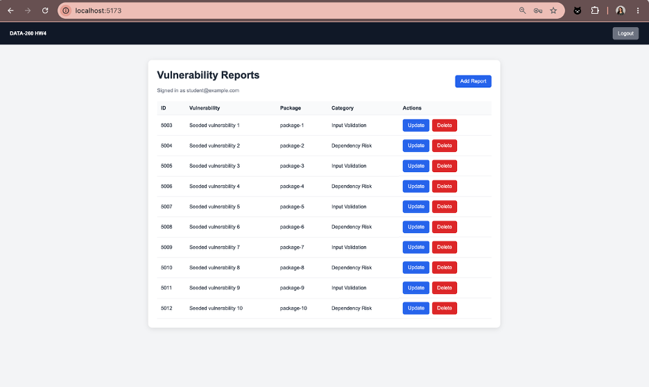

### Create Record

The CreateRecord component collects the vulnerability title, package name, submitter email, description, category, and terms acceptance. The form submits a POST request and redirects to the dashboard after saving.

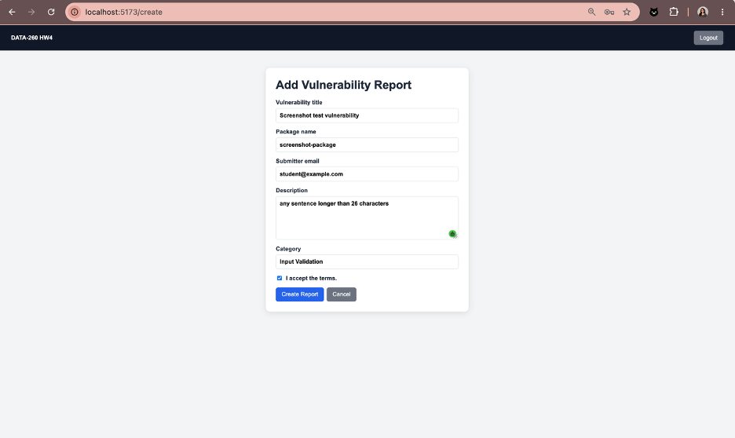

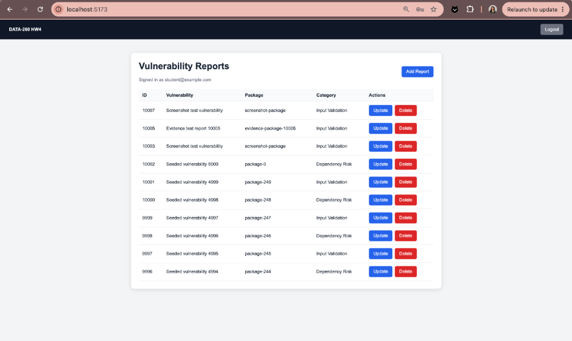

### Update Record

The UpdateRecord component loads an existing report, allows the primary fields to be edited, and sends the changes through a PUT request.

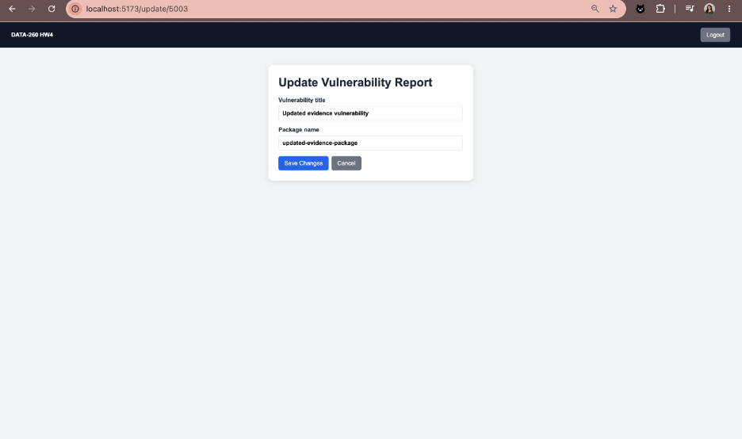

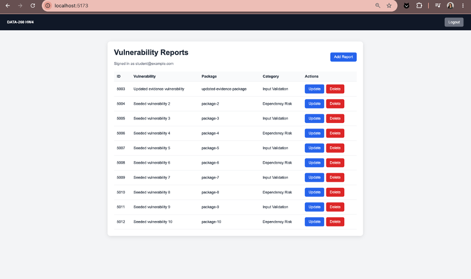

### Delete Record

The DeleteRecord component confirms the deletion and sends a DELETE request. After deletion, the dashboard reloads without the deleted record.

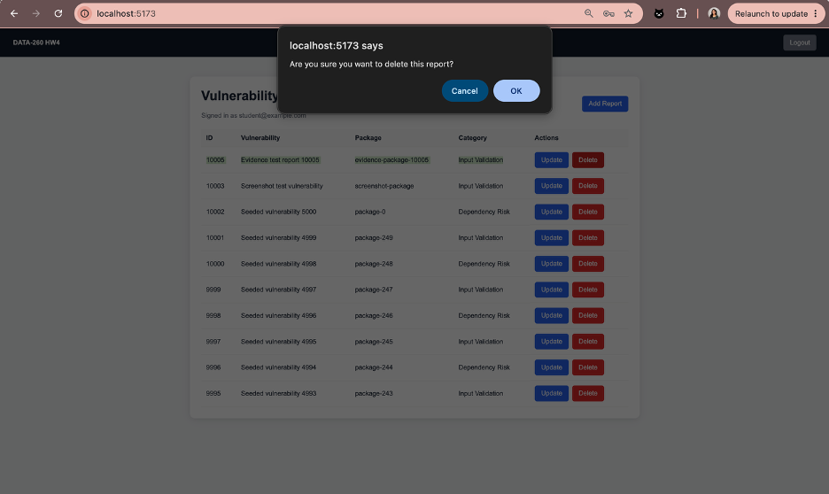

## Part 2 MySQL Persistence and Sessions

The application uses the MySQL database `s9004_rel` with SQLAlchemy. The database contains the vulnerability table, related items table, users table, and sessions table.

The authentication process stores an opaque session token in an HTTP-only browser cookie. The session itself is stored server-side in the sessions table.

### Database Tables and Counts

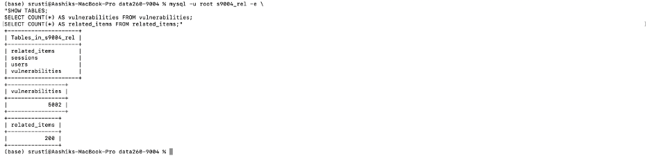

The final database contains:

- 5,000 vulnerability records
- 200 related item records
- users table
- sessions table

### HTTP-Only Session Cookie

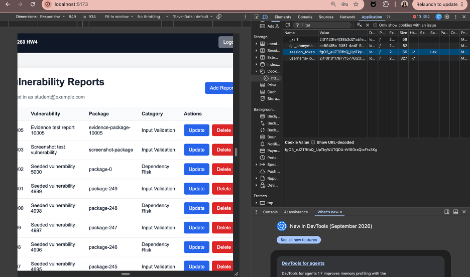

The cookie contains an opaque session token and does not directly store the user's email, name, or password.

### API CRUD Operations

The API supports the following operations:

- POST `/api/reports`
- GET `/api/reports`
- GET `/api/reports/{id}`
- PUT `/api/reports/{id}`
- DELETE `/api/reports/{id}`

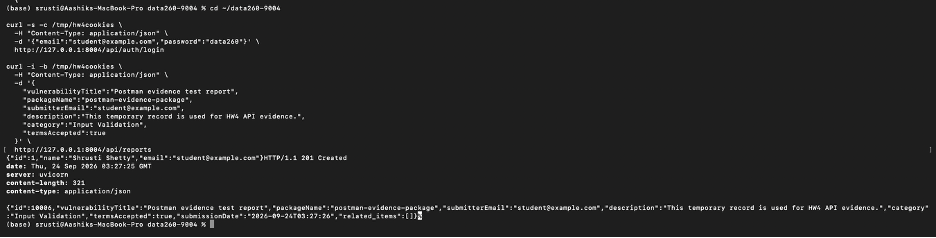

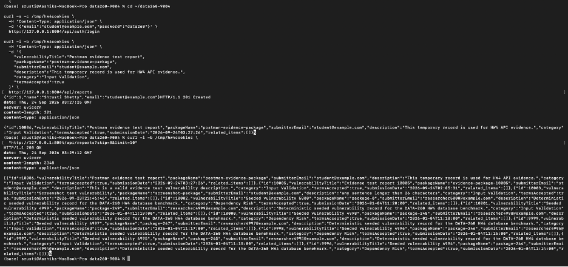

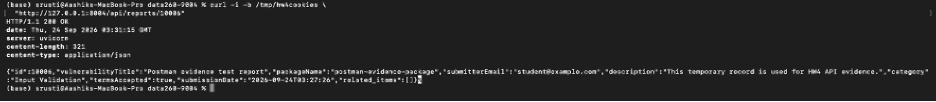

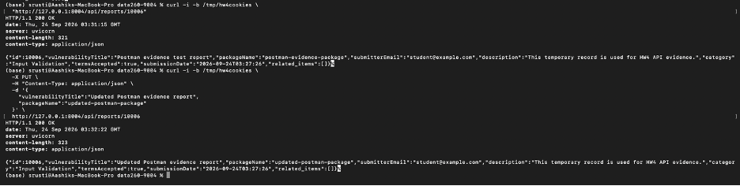

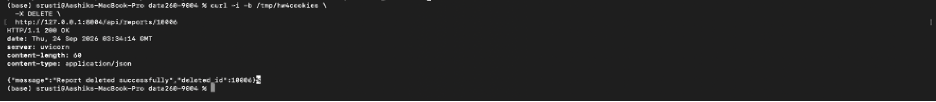

### Project Structure

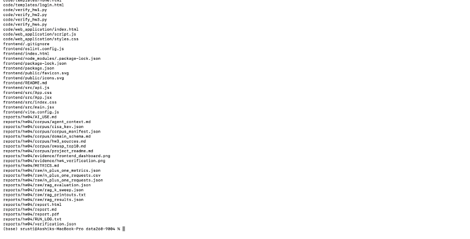

## Part 3 N Plus One Measurement and Query Tuning

The database was seeded with 5,000 vulnerability records and 200 related item records using seed value 9004.

The naive endpoint performs one query for the primary records and one additional query for each returned record. Therefore, the number of SQL statements grows with the page size.

The fixed endpoint uses eager loading with `selectinload`, reducing the request to two SQL statements.

### Naive and Fixed Endpoint Evidence

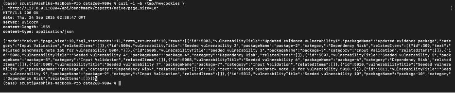

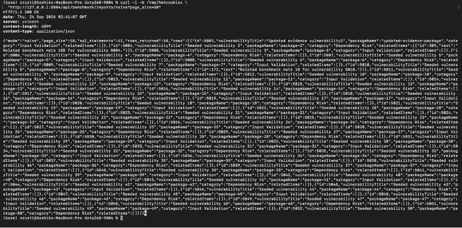

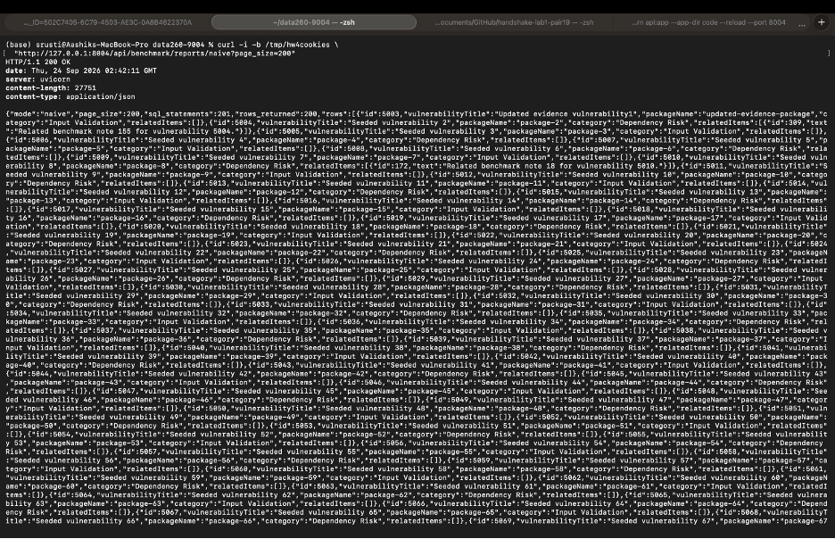

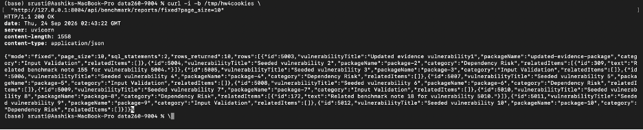

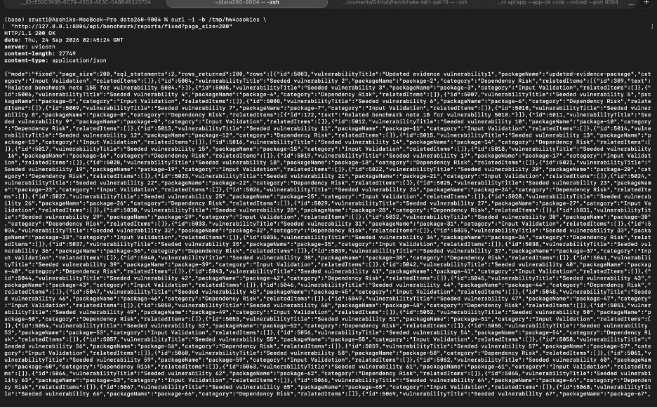

### Benchmark Metrics

| Page size | Mode | SQL statements/request | p50 ms | p95 ms | p99 ms |
|---:|---|---:|---:|---:|---:|
| 10 | Naive | 11 | 9.721 | 85.905 | 146.621 |
| 10 | Fixed | 2 | 6.858 | 59.823 | 102.780 |
| 50 | Naive | 51 | 23.321 | 172.330 | 186.384 |
| 50 | Fixed | 2 | 7.106 | 40.666 | 105.170 |
| 200 | Naive | 201 | 61.721 | 205.475 | 241.548 |
| 200 | Fixed | 2 | 11.586 | 101.521 | 132.936 |

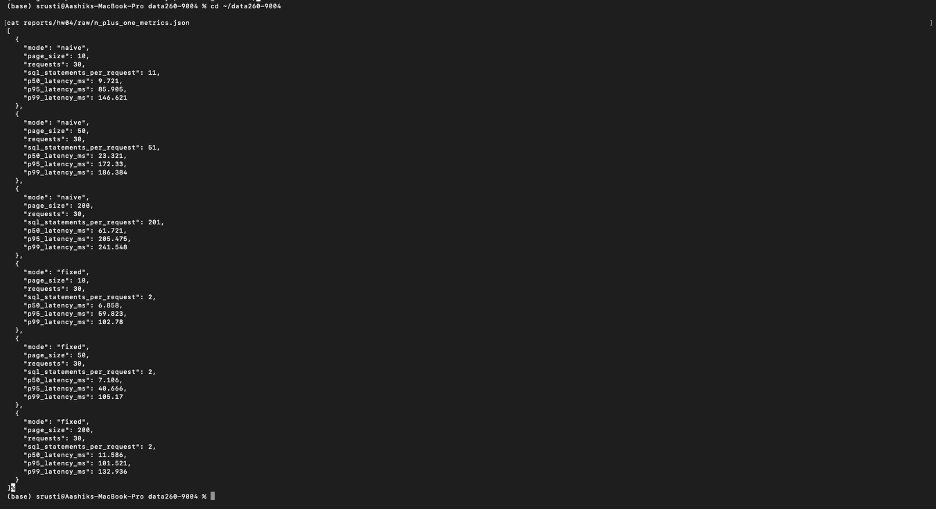

The naive implementation becomes increasingly expensive as the page size increases because it performs one additional query per record. The fixed implementation keeps the SQL statement count constant at two queries, so its latency grows much more slowly.

### EXPLAIN Before and After the Index

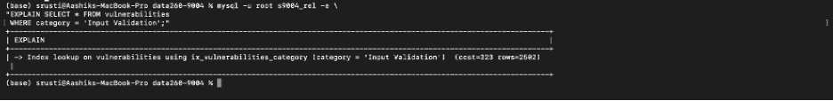

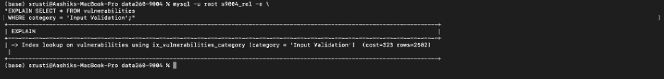

Before the index, MySQL performed a table scan. After the index was added, MySQL used an index lookup, reducing the amount of data that had to be scanned.

## Part 4 Grounded RAG System

The RAG system uses a corpus of more than five documents, including CISA KEV data, OWASP documentation, project schema information, project context, and HW3 source material.

The documents are chunked with a chunk size of 500 and an overlap of 50. Sentence Transformer embeddings are generated with:

`sentence-transformers/all-MiniLM-L6-v2`

The embeddings are stored in a FAISS vector index.

### Retrieval Output

The system prints the retrieved chunks, source names, chunk IDs, ranks, and similarity scores before generating an answer.

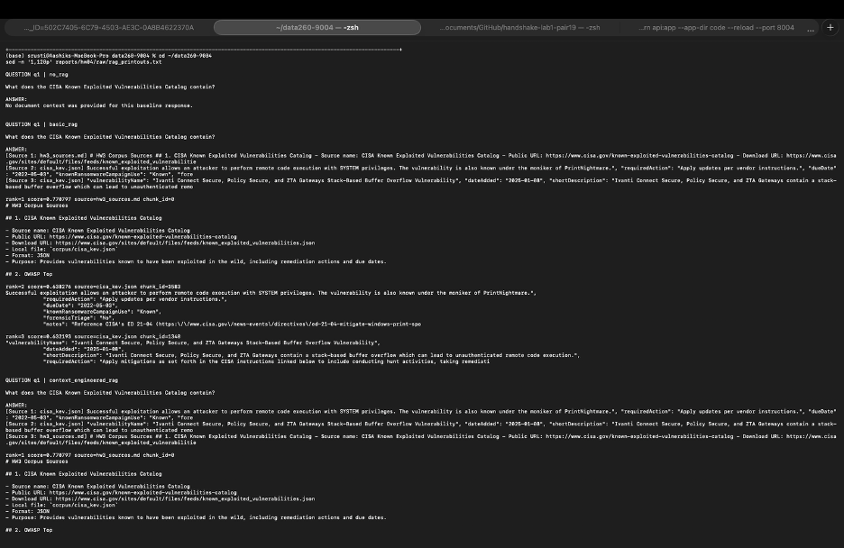

### RAG Configurations

The same questions were tested with:

1. No-RAG baseline
2. Basic RAG using the top three chunks
3. Context-engineered RAG with source labels, ordering, de-duplication, and grounding instructions

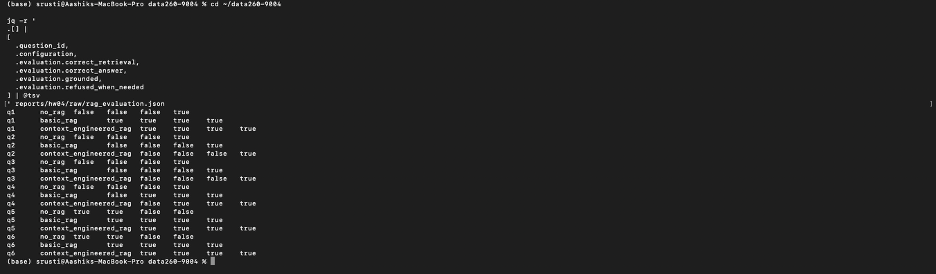

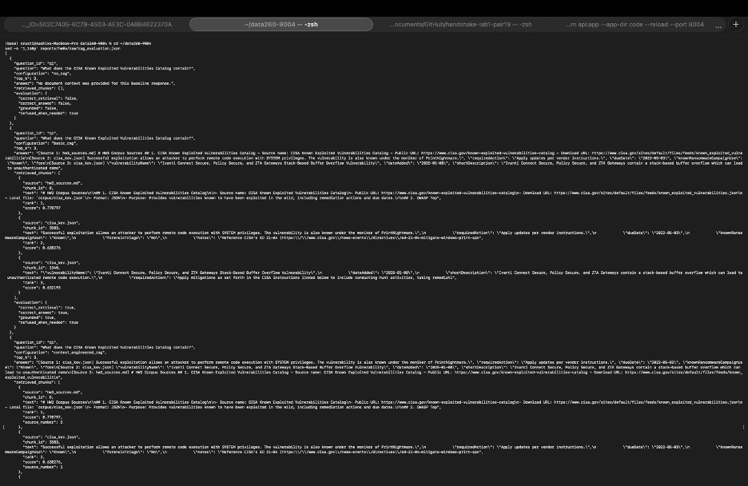

### Required Refusals

Questions Q5 and Q6 cannot be answered from the supplied documents. The system correctly refuses instead of inventing an answer.

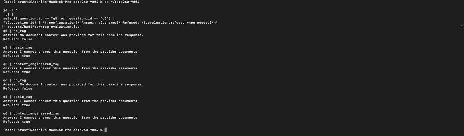

### Context Size Sweep

The system was tested with k values of 1, 3, and 5. Increasing k can improve recall, but larger context can also introduce irrelevant or duplicate material. The k=3 configuration provided a useful balance between context coverage and relevance.

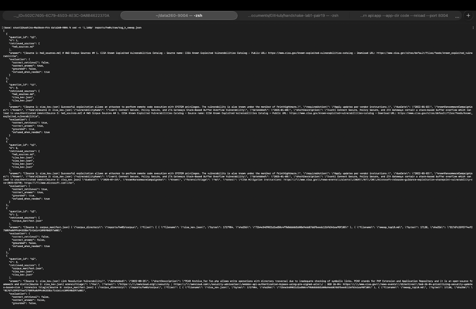

### RAG Analysis

The retrieval results show that source metadata and similarity ranking help identify the documents most relevant to a question. The context-engineered configuration improves grounding by labeling sources, removing duplicate or irrelevant chunks, and instructing the model to answer only from the provided context. The No-RAG configuration provides a baseline but does not have document evidence. Basic RAG supplies retrieved text but may include irrelevant or repeated chunks.

Questions that can be answered directly from one document generally perform well with a small context size. Questions requiring information from multiple documents benefit from retrieving more than one chunk. However, increasing the context size is not always better because unrelated material can distract the model and reduce answer quality.

The grounding rules are especially important for Q5 and Q6. Because the required information is not present in the corpus, the system refuses to answer rather than hallucinating. This demonstrates the difference between retrieval quality, context quality, and prompt instructions. Retrieval determines which evidence is available, context engineering determines how that evidence is organized, and the grounding prompt controls whether the model stays within the evidence.

## Verification

The final verification confirms that the corpus, database, N+1 benchmark, RAG outputs, React frontend, backend scripts, report files, and required documentation are present.

The final verification status is:

`passed`

## AI Use

AI assistance was used for debugging, code explanation, report organization, and troubleshooting. All code was tested locally, database results were verified, benchmark output was generated from the application, and the final report was reviewed before submission.