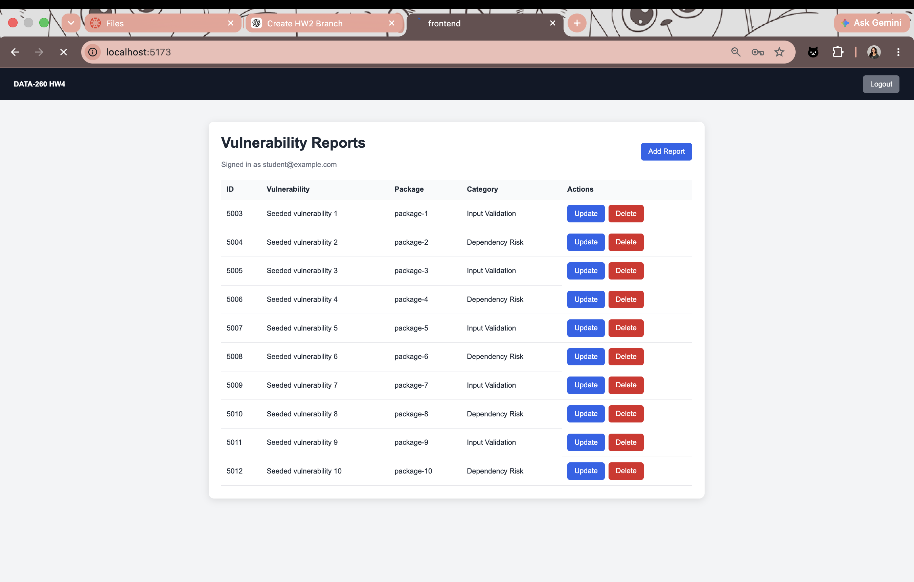
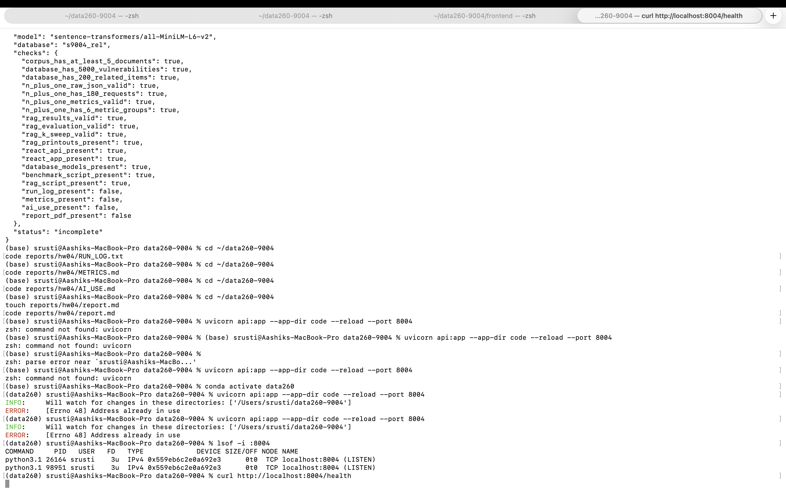

# DATA-260 Homework 4 Report

## Student Information

- Student: Shrusti Shetty
- SID4: 9004
- Domain: Open-Source Package Vulnerabilities
- Branch: hw4
- Database: s9004_rel
- Seed: 9004
- Verify seed: 269004

## 1. Project Overview

This project extends the HW3 vulnerability-report application.

The HW4 system includes:

- A React frontend
- FastAPI backend routes
- MySQL persistence
- HTTP-only cookie authentication
- Server-side sessions
- Create, read, update, and delete operations
- N+1 query benchmarking
- RAG document retrieval and evaluation

## 2. React Frontend

The React client provides login, report listing, report creation, report updating, and report deletion.

Main React components:

- `Login.jsx`
- `Home.jsx`
- `CreateRecord.jsx`
- `UpdateRecord.jsx`
- `DeleteRecord.jsx`

The frontend uses Axios to communicate with FastAPI and React Router for navigation.

Important routes:

- `/`
- `/create`
- `/update`
- `/delete`

The frontend was tested by logging in, creating a report, viewing it, updating it, deleting it, and logging out.

Example API call:

```javascript
await api.post("/api/reports", payload)
## 10. Evidence Screenshots

### React Dashboard

The React dashboard displays the logged-in user and seeded vulnerability records with Update and Delete actions.



### HW4 Verification

The verification output confirms the database, N+1 benchmark, RAG, and frontend checks.



## 9. Final Git Reference

- Repository: https://github.com/shrustishetty-2401/data260-9004
- Final branch: hw4
- Final tag: hw4
- Final commit: recorded in `reports/hw04/verification.json`